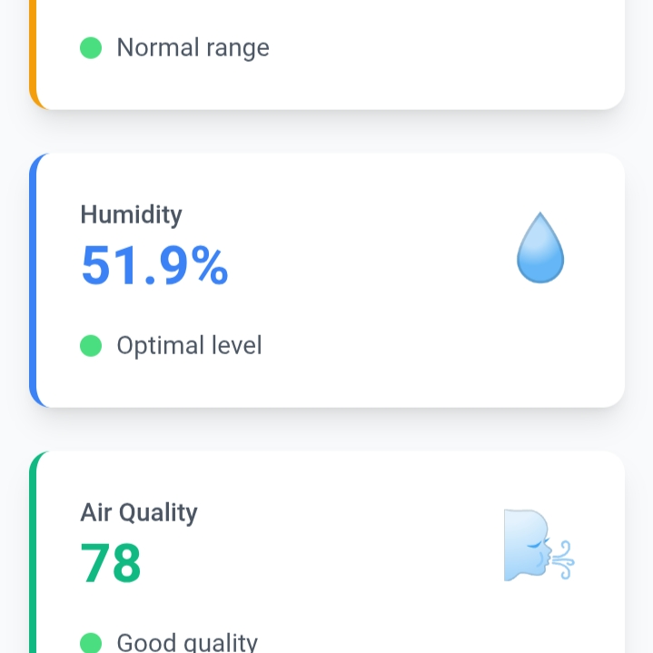
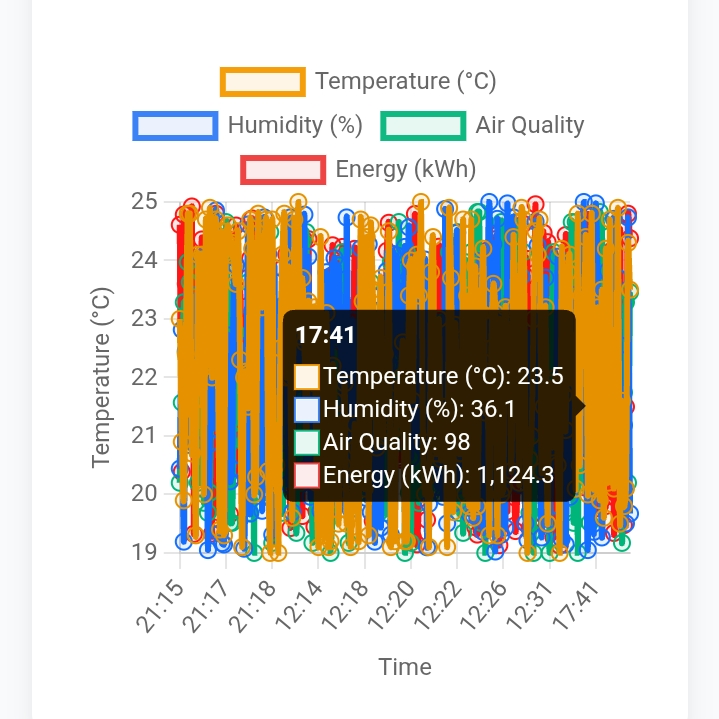
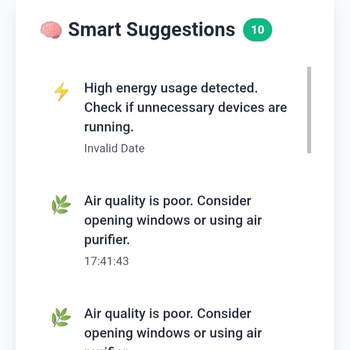
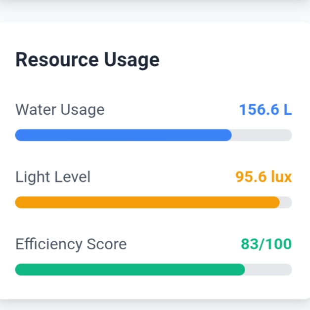

# Smart-home
Be smart and design your home smartly.
## 📸 Screenshots

### 📍 Front face

### ⚡ Energy Graph

### 🍃 Smart suggestions 

### 📊 Resource usage

> 💡 You can use the above images by saving your screenshots in your GitHub repo.

---
> You can see another readme.md file. How to proceed and use the code all is documented under those readme.md file.
---
> Thank You
---
> Author - Sayan
